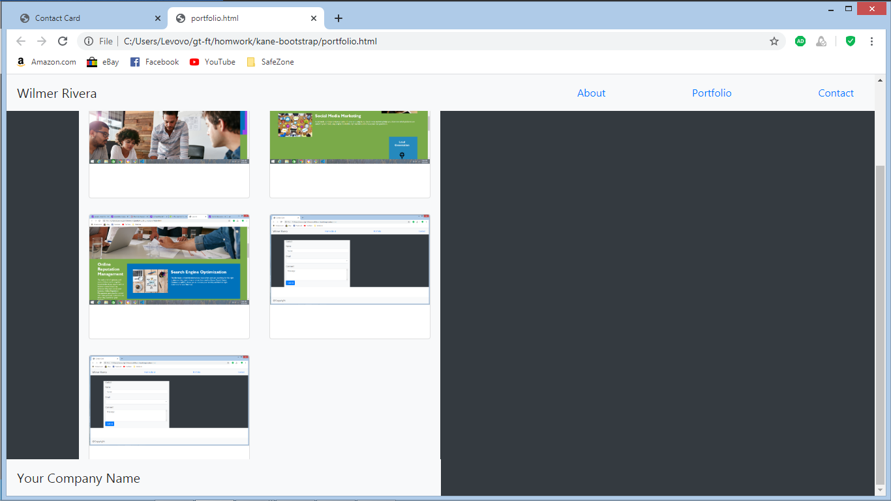
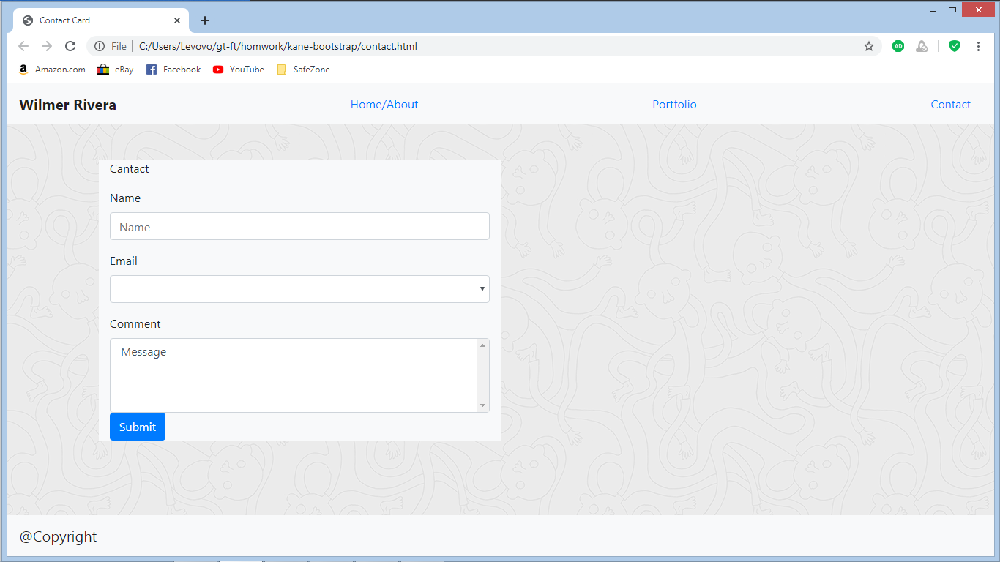
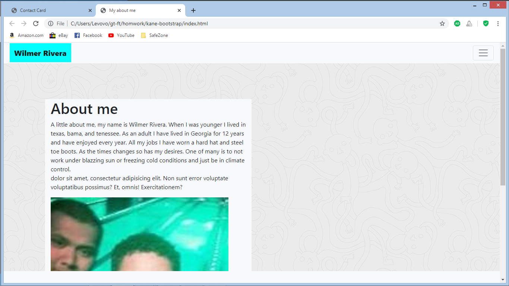

# kane-bootstrap

These are the pages I was asked to creat for my bootstrap introduction.

All pages were created with basic bootstrap components from the get bootstrap page.

The index html gives a little info about my background and where grew up, and
and a few small thing about me. It contains only one picture of a few of me,
with links to my other pages.

The second file is the portfolio page with images of my past projects
working with html, css and bootstrap. It also contains links to my other two pages

The third file is a basic cantact card, with contact options to leave name, email and msg.
Available links to my other pages. Index and portfolio.

[this is the link to the page](https://wilmer88.github.io/kane-bootstrap/)
